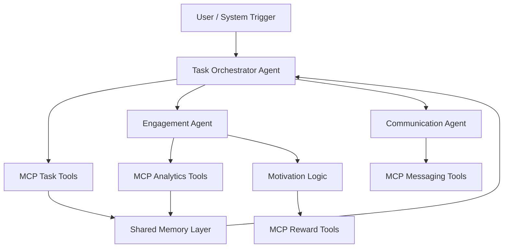

# 🏡 ChoreQuest

### Intelligent Multi-Agent Task Coordination for Families

[]()
[]()
[]()
[]()
[]()
[]()

ChoreQuest is a multi-agent AI system that transforms household task management into an intelligent, transparent, and personalized experience.

Instead of assigning chores manually, two specialized AI agents collaborate using structured tools, persistent memory, and reasoning to distribute work fairly, monitor engagement, and recommend personalized motivation strategies.

Built as the capstone project for the **5-Day AI Agents: Intensive Vibe Coding Course with Google**.

---

---

## ⚖️ Why ChoreQuest?

Managing household responsibilities is not just about assigning tasks — it is about maintaining fairness, visibility, and sustained participation over time.

As family dynamics evolve, chore distribution often becomes:
- based on memory rather than data  
- uneven due to invisible workload differences  
- inconsistent due to lack of feedback loops  
- demotivating when effort is not recognized  

ChoreQuest is designed to solve these gaps through an AI-driven coordination system.

---

## ⚖️ Fair Task Distribution

Traditional chore charts are static and fail to adapt to real-world conditions.

ChoreQuest evaluates:

- current workload per individual  
- task difficulty and context  
- historical participation patterns  
- individual preferences and strengths  

This enables **adaptive and explainable task allocation**, rather than fixed schedules.

---

## 📊 Engagement Awareness

Task completion alone does not reflect true participation health.

ChoreQuest continuously analyzes:

- completion consistency  
- workload imbalance  
- participation trends over time  
- early signals of disengagement or burnout  

This allows the system to surface issues early instead of reacting after breakdowns occur.

---

## 🎁 Adaptive Motivation

Motivation is not universal.

Instead of a fixed reward model, ChoreQuest:

- learns individual response patterns  
- adapts incentives dynamically  
- reinforces positive participation habits  
- supports sustained engagement over time  

---

## 🧠 Why AI Agents?

These challenges cannot be solved effectively with static rules because they require:

- multi-factor reasoning  
- context awareness across time  
- dynamic decision adjustments  
- explainability in outcomes  

AI agents are used because they can:

- 🧠 reason over structured real-world data instead of fixed rules  
- 🔧 interact with MCP tools to retrieve accurate, real-time context  
- 🤝 collaborate through shared memory to maintain consistency  
- 📖 generate explainable decisions rather than opaque outputs  

---

## 💡 Outcome

ChoreQuest functions as a **coordination layer for household participation**, combining reasoning, memory, and tool use to produce fair, transparent, and adaptive task management.

---

---

## ✨ Features

ChoreQuest is designed as a modular multi-agent system focused on intelligent coordination, engagement tracking, and adaptive motivation.

---

## 🤖 Multi-Agent Architecture

The system is powered by specialized AI agents that collaborate to solve different parts of the problem:

- Task Orchestrator Agent → assigns and balances workloads  
- Engagement Agent → tracks participation trends  
- Motivation Agent → personalizes rewards and incentives  
- Communication Agent → delivers reminders and updates  

Each agent operates independently but shares context through a unified memory layer.

---

## 🔧 MCP Tool Integration

ChoreQuest uses MCP-style tools to ensure agents operate on real, structured data instead of hallucinations.

Capabilities include:

- task retrieval and updates  
- engagement analytics queries  
- reward calculation logic  
- communication triggers  

This ensures **tool-grounded reasoning instead of pure LLM inference**.

---

## 🧠 Agentic Reasoning

Agents do not simply respond — they reason through multi-step decision flows:

- analyze current state  
- retrieve relevant context via tools  
- evaluate constraints (fairness, workload, history)  
- generate explainable decisions  

This allows decisions to be **transparent and auditable**.

---

## 💾 Persistent Shared Memory

ChoreQuest maintains a shared memory layer that stores:

- task history  
- participation patterns  
- user preferences  
- engagement trends  

This enables:
- continuity across sessions  
- personalization over time  
- context-aware decision making  

---

## 📊 Engagement Intelligence

The system continuously evaluates participation signals such as:

- completion rate trends  
- workload imbalance detection  
- inactivity or drop-off patterns  
- consistency over time  

This allows early detection of disengagement or burnout.

---

## 🎁 Adaptive Motivation System

Instead of static rewards, ChoreQuest dynamically adapts incentives based on behavior.

Examples include:
- personalized reward suggestions  
- engagement-based encouragement  
- workload-sensitive adjustments  
- positive reinforcement loops  

---

## ⚙️ Lightweight & Extensible Design

The architecture is designed to be:

- modular (agents can be added or replaced)  
- tool-driven (MCP-based extensibility)  
- framework-agnostic at the core logic layer  
- easy to extend into organizational or educational use cases  

---

---

## 🏗 System Architecture

The ChoreQuest system is built as a **multi-agent orchestration pipeline** where each agent operates independently but shares a common memory and tool layer.

The architecture prioritizes:
- clear separation of concerns  
- tool-grounded reasoning  
- shared state consistency  
- explainable decision flows  

---

### 📊 High-Level Flow



---

---
## 🔄 Agent Workflow

ChoreQuest operates as a continuous multi-agent reasoning loop. Each cycle processes system state, applies tool-based reasoning, and updates shared memory for future decisions.

The workflow focuses on **how information flows through the system at runtime**, not individual agent definitions.

---

## ⚙️ Execution Cycle

### 1. System Trigger
A cycle begins when the system is triggered (scheduled or event-driven).

### 2. State Retrieval
The Task Orchestrator retrieves the latest state from:
- shared memory  
- MCP task tools  
- engagement history  

### 3. Decision Planning
The Orchestrator determines:
- which tasks need action  
- which agents should be activated  
- what data must be fetched via MCP tools  

### 4. Tool Execution
Relevant MCP tools are invoked to fetch structured and up-to-date information.

### 5. Agent Processing
Specialized agents process the enriched context in parallel:
- engagement analysis is computed  
- motivation signals are generated  
- communication needs are evaluated  

### 6. State Update
All outputs are written back to shared memory, updating:
- task states  
- engagement metrics  
- system logs  
- user activity history  

### 7. Cycle Completion
The system returns to an idle state until the next trigger.

---

## 🔁 Continuous Reasoning Loop

ChoreQuest does not operate as a one-time pipeline.

Instead, it runs as a repeating loop:

> Observe → Retrieve → Plan → Execute → Update → Repeat

This allows the system to continuously adapt to changing user behavior and workload conditions.

---

## 🧠 Key System Behavior

- Each cycle is state-driven, not prompt-driven  
- MCP tools ensure decisions are grounded in real data  
- Shared memory ensures continuity across cycles  
- Agents contribute partial decisions that are merged into a final system state  

---

## ⚙️ Design Principle

> The workflow defines *how the system runs*, not *who the agents are*.

This ensures clear separation between:
- execution flow (workflow)  
- system components (agents)  
---

---

## 🔌 MCP Tools

ChoreQuest uses MCP (Model Context Protocol-style) tools to provide agents with structured, reliable access to system data and external operations.

Instead of relying on free-form model reasoning, agents interact with **deterministic tool interfaces** to ensure accuracy, consistency, and traceability.

---

## 🧠 Why MCP Tools?

Large language models alone are prone to:
- hallucinated task states  
- inconsistent memory recall  
- unreliable calculations  
- lack of auditability  

MCP tools solve this by acting as a **controlled execution layer between agents and system data**.

---

## 🧩 Tool Categories

ChoreQuest organizes MCP tools into four core domains:

---

### 📋 Task Coordination Tools

Responsible for managing the core task system.

Capabilities:
- fetch current tasks  
- create or update assignments  
- track task completion state  
- resolve conflicts in task distribution  

Used primarily by:
- Task Orchestrator Agent  

---

### 📊 Analytics & Engagement Tools

Provide structured insights into participation behavior.

Capabilities:
- compute engagement scores  
- analyze completion trends  
- detect inactivity or overload  
- generate workload distribution metrics  

Used primarily by:
- Engagement Agent  
- Orchestrator Agent  

---

### 🎁 Reward & Motivation Tools

Handle incentive and reinforcement logic.

Capabilities:
- calculate reward eligibility  
- generate personalized motivation signals  
- update reward state  
- track participation-based points  

Used primarily by:
- Motivation Agent  

---

### 💬 Communication Tools

Enable controlled outbound messaging.

Capabilities:
- generate reminder messages  
- format contextual updates  
- trigger notifications  
- manage communication scheduling  

Used primarily by:
- Communication Agent  

---

## 🔁 How Agents Use MCP Tools

Agents do not directly access raw system state.

Instead, they follow this pattern:

1. Interpret current task or context  
2. Request relevant data via MCP tools  
3. Receive structured responses  
4. Apply reasoning on validated data  
5. Produce final action or decision  
6. Persist results back to shared memory  

---

## 🧠 Key Design Principle

> MCP tools ensure agents operate on verified data, not inferred assumptions.

This guarantees:
- consistent decision-making across agents  
- reproducible system behavior  
- reduced hallucination risk  
- clear audit trails for every action  

---

## ⚙️ System Benefit

By introducing MCP tools, ChoreQuest transforms agents from:
> “language-based responders”

into:
> “tool-driven decision systems operating on real structured data”

---

---
## 💾 Persistent Memory

ChoreQuest maintains a shared persistent memory layer that enables agents to retain context across execution cycles.

This allows the system to move beyond stateless interactions and operate as a **continuously learning coordination system**.

---

## 🧠 Why Persistent Memory?

Without memory, each agent cycle would:
- treat every request as independent  
- lose historical context  
- repeat past decisions  
- fail to adapt behavior over time  

Persistent memory solves this by preserving structured system state across cycles.

---

## 🧩 What is Stored in Memory?

ChoreQuest memory is organized into structured state categories:

### 📋 Task History
- completed tasks  
- pending assignments  
- task ownership changes  
- completion timestamps  

---

### 👤 Participation History
- individual contribution patterns  
- frequency of task completion  
- consistency over time  

---

### 📊 Engagement Signals
- workload distribution trends  
- inactivity detection markers  
- burnout risk indicators  
- participation anomalies  

---

### 🎁 Motivation & Reward State
- reward history  
- incentive effectiveness tracking  
- engagement response patterns  

---

## 🔁 How Memory is Used

Memory is not passive storage — it is actively queried and updated during every system cycle:

1. Agents retrieve relevant historical context  
2. Decisions are influenced by past behavior patterns  
3. New outputs are written back into memory  
4. Future cycles build on updated state  

---

## 🧠 Key Design Principle

> Memory acts as the system’s long-term reasoning substrate.

It enables:
- continuity across agent cycles  
- personalization over time  
- evolving decision quality  
- consistent behavioral tracking  

---

## ⚙️ System Behavior Enabled by Memory

With persistent memory, ChoreQuest can:

- detect long-term engagement trends  
- avoid repetitive or unfair task assignments  
- adapt motivation strategies over time  
- maintain context across system restarts  

---

## 💡 Outcome

Persistent memory transforms ChoreQuest from a stateless agent pipeline into a **stateful coordination system that improves with continued use**.

---

---

## 🧠 Agentic Reasoning

ChoreQuest implements an agentic reasoning model where decisions are produced through structured multi-step reasoning rather than single-step LLM outputs.

This allows the system to behave as a **deliberate, tool-grounded decision engine**.

---

## 🔁 Core Reasoning Cycle

Each agent follows a consistent reasoning loop:

### 1. Observe
The agent reads the current system state:
- shared memory  
- MCP tool outputs  
- incoming task context  

---

### 2. Retrieve Context
Relevant structured information is gathered:
- task history  
- engagement patterns  
- workload distribution  
- user behavior signals  

---

### 3. Analyze
The agent evaluates:
- fairness constraints  
- system objectives  
- historical trends  
- conflicts or imbalances  

---

### 4. Decide
A structured decision is generated based on:
- tool-validated data  
- memory context  
- agent-specific responsibility  

---

### 5. Act
Execution occurs via:
- MCP tool calls (tasks, rewards, communication)  
- or structured outputs passed to other agents  

---

### 6. Persist
All results are written back into shared memory for future cycles.

---

## 🧠 Multi-Agent Reasoning Model

Reasoning is distributed across specialized agents:

- Task Orchestrator → global coordination decisions  
- Engagement Agent → behavioral and participation insights  
- Motivation Agent → incentive optimization  
- Communication Agent → contextual messaging decisions  

Each agent contributes partial reasoning that is merged into a unified system state.

---

## 🔌 Tool-Grounded Reasoning

Agents do not rely on assumptions.

All critical decisions are grounded via MCP tools:
- task state is retrieved, not guessed  
- engagement metrics are computed, not inferred  
- rewards are calculated, not hallucinated  

---

## 💾 Memory-Augmented Reasoning

Persistent memory enhances reasoning by:
- preserving long-term patterns  
- enabling personalization over time  
- preventing repetitive decisions  
- maintaining continuity across cycles  

---

## ⚙️ Key Principle

> Agentic reasoning is a structured combination of memory, tools, and multi-step deliberation — not a single model response.

---

## 💡 Outcome

This design enables ChoreQuest to function as a **consistent, explainable, and adaptive multi-agent system** that improves with continued use.

---

---

## ⚙️ Technology Stack

ChoreQuest is built using a modular, agent-centric stack designed for tool-augmented reasoning and persistent multi-agent coordination.

---

## 🧠 Core Runtime

- Python 3.11+ → main agent execution engine  
- JSON-based state system → shared memory and data exchange  
- Event-driven loop → continuous reasoning cycles  

---

## 🤖 AI System

- LLM-powered agents with structured tool usage  
- MCP-style tool execution layer  
- Multi-agent orchestration framework  
- Shared memory coordination model  

---

## 🔌 Tooling Layer

- MCP (Model Context Protocol-style) tools  
- Isolated tool execution interfaces  
- Structured input/output contracts  
- Deterministic function-based operations  

---

## 💾 State & Memory

- Persistent shared memory (JSON-based)  
- Historical tracking of tasks and engagement  
- Agent-readable structured state  
- Cycle-to-cycle continuity layer  

---

## 🏗 Architecture Style

- Modular agent separation  
- Tool-first design philosophy  
- Stateless tool execution  
- Central orchestrator loop  
- Event-driven multi-agent coordination  

---

## 💡 Design Goal

The stack is intentionally lightweight and transparent to ensure:

- explainable agent behavior  
- reproducible execution  
- easy debugging of reasoning flows  
- extensibility for future agents and tools  
---

---
## 📁 Project Structure

ChoreQuest is organized into clear layers separating agents, tools, memory, and execution logic.

---

## 🏗 Repository Layout

```bash
task-coordination-agent/
│
├── agents/
│   ├── orchestrator.py          # Task assignment logic
│   ├── engagement_agent.py      # Tracks participation patterns
│   ├── motivation_agent.py      # Generates reward suggestions
│   ├── communication_agent.py   # Handles notifications
│   └── agent_loop.py            # Main execution loop (run this)
│
├── mcp_servers/
│   ├── task_tools/
│   │   └── task_tools.py        # list_tasks, assign_task, get_user_capacity
│   ├── analytics_tools/
│   │   └── analytics_tools.py   # get_engagement_metrics
│   ├── reward_tools/
│   │   └── reward_tools.py      # suggest_reward, update_points_ledger
│   └── communication_tools/
│       └── communication_tools.py
│
├── memory/
│   ├── shared_memory.json       # Persistent system state
│   └── memory_manager.py        # Read/write abstraction
│
├── scripts/
│   ├── seed_demo.py             # Demo data (5 family members, 6 tasks)
│   └── run_system.bat           # Windows startup script
│
├── benchmark/
│   ├── scenarios.json           # 10 test scenarios
│   └── run_benchmark.py         # Benchmark runner
│
├── docs/
│   ├── ARCHITECTURE.md
│   ├── KAGGLE_WRITEUP.md
│   └── NEXT_STEPS.md
│
├── agent_tools.py               # Tool definitions (OpenAI format)
├── README.md
└── requirements.txt
```
---

---

## 🚀 Installation

Follow these steps to set up ChoreQuest locally.

---

## 📦 Prerequisites

Ensure you have the following installed:

- Python 3.11+
- pip (Python package manager)
- Git
- Msty (https://msty.ai)

---

### 📥 1. Clone Repository

```bash
git clone https://github.com/JugalMahendra/task-coordination-agent.git
cd task-coordination-agent
```
### 📦 2. Install Dependencies
```bash
pip install openai
```
### ⚙️ 3. Setup Msty

1. Install Msty from https://msty.ai
2. Download granite4 model in Msty
3. Enable Tools as a purpose for the model (Model dropdown → Edit → Enable Tools)
4. Start Msty (runs on localhost:10000)

### 🧠 4. Verify Setup

Ensure all modules load correctly:

```bash
py scripts/seed_demo.py
```

💡 Notes
- No database setup required
- Memory is stored locally in JSON format
- MCP tools run as local Python modules
- LLM runs locally via Msty (no API costs)

---

## ▶️ Running Project

This section explains how to run the full ChoreQuest system locally.

**Prerequisites:**
- Python 3.11+
- Msty running with granite4 model loaded (localhost:10000)

---

### 🚀 Quick Start

```bash
# 1. Start Msty with granite4 loaded

# 2. Run the multi-agent system
py agents/agent_loop.py "assign all pending tasks"
```

---

### 🧩 Alternative Run Commands

```bash
# Interactive mode (no arguments)
py agents/agent_loop.py

# Run seed data test
py scripts/seed_demo.py

# Run benchmark
py benchmark/run_benchmark.py
```

---

### 🔄 What Happens

When you run the command:
1. Orchestrator Agent calls list_tasks() to see pending tasks
2. Orchestrator checks get_user_capacity() for each family member
3. Orchestrator calls assign_task() to assign tasks
4. Motivator Agent calls get_engagement_metrics() for each child
5. Motivator calls suggest_reward() for top performers
6. Results saved to memory/shared_memory.json

---

---
## 💡 Example Session

This section demonstrates how ChoreQuest behaves during a typical execution cycle.

---

### 🧾 Input

```bash
py agents/agent_loop.py "assign all pending tasks"
```

### 🧠 System Processing Flow
1. Orchestrator receives request
2. Orchestrator calls list_tasks() → gets 6 pending tasks
3. Orchestrator calls get_user_capacity() for emma, john, lily
4. Orchestrator calls assign_task() for each task
5. Motivator calls get_engagement_metrics() for each child
6. Motivator calls suggest_reward() for each child
7. Results saved to memory/shared_memory.json

---

### 📤 Output

```
Phase 1: Orchestrator (Task Assignment)
  -> Orchestrator calling list_tasks
  -> Orchestrator calling get_user_capacity
  -> Orchestrator calling assign_task
  -> Orchestrator calling assign_task
  -> Orchestrator calling assign_task

[Orchestrator] Tasks assigned: Emma gets Dishes, Lily gets Set table, John gets Vacuum

Phase 2: Motivator (Engagement Analysis)
  -> Motivator calling get_engagement_metrics
  -> Motivator calling suggest_reward

[Motivator] Emma has 1 assigned task. All members at 0% completion (new assignments).
```

---

### 🔁 Memory Update

System state is persisted to memory/shared_memory.json:
- orchestrator_messages: full conversation history
- motivator_messages: engagement analysis
- assignments: task assignments
---

### 💡 Key Insight

Each execution is not isolated.

Instead, every cycle:

* builds on previous state
* improves future decisions
* adapts to user behavior over time
---

---

## 📊 Evaluation

ChoreQuest is evaluated based on its ability to coordinate tasks intelligently, maintain fairness, and adapt over time using agentic reasoning.

The evaluation focuses on **system behavior quality**, not just functional correctness.

---

## ⚖️ 1. Task Allocation Fairness

Measures how evenly and appropriately tasks are distributed across users.

Key indicators:
- workload balance across participants  
- avoidance of repeated assignments  
- alignment with user capability and history  

---

## 📊 2. Engagement Tracking Accuracy

Evaluates how well the system identifies participation patterns.

Key indicators:
- detection of inactivity trends  
- identification of overburdened users  
- consistency of engagement scoring  

---

## 🧠 3. Reasoning Consistency

Assesses whether agents make stable and logical decisions across cycles.

Key indicators:
- repeatability of decisions under similar conditions  
- consistency across agent outputs  
- absence of contradictory actions  

---

## 🔁 4. System Adaptability

Measures how effectively the system improves decisions over time.

Key indicators:
- adjustment based on historical feedback  
- personalization of task assignments  
- evolving motivation strategies  

---

## 💬 5. Explainability

Ensures that every decision can be traced back to:
- MCP tool outputs  
- memory state  
- agent reasoning steps  

---

## 💡 Summary

ChoreQuest is not evaluated as a static system.

Instead, it is assessed as a **dynamic coordination engine that improves with continuous interaction and feedback loops**.

---

---
## 🔐 Security

ChoreQuest is designed with controlled execution principles to ensure safe and predictable multi-agent behavior.

The system prioritizes **structured tool execution over unrestricted model output**.

---

## 🧩 1. MCP Tool Isolation

All external operations are executed through MCP tools.

This ensures:
- agents cannot directly mutate system state  
- all actions are validated through tool interfaces  
- execution paths remain deterministic  

---

## 🧠 2. No Direct State Mutation

Agents do not directly modify memory or system data.

Instead:
- all updates go through controlled interfaces  
- changes are validated before persistence  
- state transitions are traceable  

---

## 🔑 3. Environment-Based Secrets

Sensitive configuration is never hardcoded.

- API keys are stored in environment variables  
- `.env` files are excluded from version control  
- runtime access is scoped and controlled  

---

## 📝 4. Full Action Logging

All system actions are recorded in memory:

- agent decisions  
- tool invocations  
- state updates  
- execution cycles  

This enables full traceability of system behavior.

---

## ⚙️ 5. Controlled Execution Loop

The system operates in a bounded reasoning loop:

Observe → Retrieve → Plan → Execute → Persist

This prevents:
- infinite uncontrolled execution  
- unsafe recursive reasoning  
- untracked state changes  

---

## 💡 Security Principle

> Agents are decision-makers, not system controllers.

All critical operations are mediated through controlled, auditable tool interfaces.

---

---

## 🗺 Roadmap

ChoreQuest is currently focused on core multi-agent coordination, with a strong foundation in reasoning, tools, and persistent memory.

Future enhancements are designed to expand usability, scalability, and real-world integration.

---

## 🚀 Planned Enhancements

### 🖥 UI Dashboard
- visual task management interface  
- real-time engagement tracking  
- family-friendly control panel  
- admin-style analytics view  

---

### 📊 Advanced Analytics
- deeper behavioral trend analysis  
- predictive engagement scoring  
- workload forecasting  
- historical performance insights  

---

### 🔔 Notification System
- email and SMS integration  
- real-time reminders  
- contextual alerts based on behavior  
- configurable notification rules  

---

### 🏢 Organizational Scaling
- extend system beyond families  
- support teams and volunteer groups  
- role-based task assignment  
- multi-group coordination  

---

## 🧠 Architecture Evolution

Future versions aim to enhance:

- richer agent collaboration patterns  
- more advanced tool orchestration  
- improved memory structuring  
- external API integrations  

---

## 💡 Vision

ChoreQuest evolves toward a **general-purpose multi-agent coordination framework** capable of managing structured human collaboration in any environment.

---

---

## 🤝 Contributing

ChoreQuest is a capstone project, but contributions and improvements are welcome.

The system is designed to remain modular and extensible for experimentation and learning.

---

## 🧠 Contribution Principles

To maintain system integrity, contributions should follow these principles:

- keep agents modular and isolated  
- preserve MCP tool boundaries  
- avoid tightly coupled logic  
- maintain deterministic execution flow  

---

## 🧩 Areas for Improvement

Contributors can enhance:

- new MCP tools  
- additional agent types  
- improved memory structures  
- better reasoning strategies  
- performance optimizations  

---

## 🔄 Development Guidelines

- maintain clear separation between agents and tools  
- ensure all state changes go through memory layer  
- keep reasoning explainable and traceable  
- avoid direct side-effects inside agents  

---

## 💡 Philosophy

> Every contribution should improve clarity, modularity, or reasoning quality of the system — not just add complexity.

---

---
## 📄 License

This project is licensed under the MIT License.

---

## 📌 Summary

You are free to:
- use  
- modify  
- distribute  
- integrate  

this project for personal or commercial purposes.

---

## ⚠️ Conditions

The only requirement is that the original license notice is included in any distributed versions of the software.

---

## 💡 Note

This project is built as part of a Kaggle AI Agents capstone submission and is intended for educational and demonstration purposes.

---

---

## 🙏 Acknowledgements

This project was made possible through a combination of course guidance, open-source tools, and the broader AI community.

---

## 🎓 Learning Program

- Kaggle AI Agents Capstone
- 5-Day AI Agents: Intensive Vibe Coding Course with Google

This program provided the foundation for exploring multi-agent systems, tool usage, and reasoning architectures.

---

## 🧠 AI & Model System

- granite4 (local LLM via Msty)
- MCP-style tool integration
- OpenAI-compatible API

---

## 🔧 Open Source Foundations

- Python ecosystem  
- Async and event-driven programming patterns  
- JSON-based state management approaches  
- General multi-agent research community contributions  

---

## 💡 Inspiration

This project is inspired by real-world coordination challenges in:
- family task management  
- volunteer organization systems  
- workload balancing problems  

---

## 🚀 Final Note

ChoreQuest represents an exploration into how structured AI agents can collaborate to solve coordination problems that traditionally rely on manual effort and human judgment.